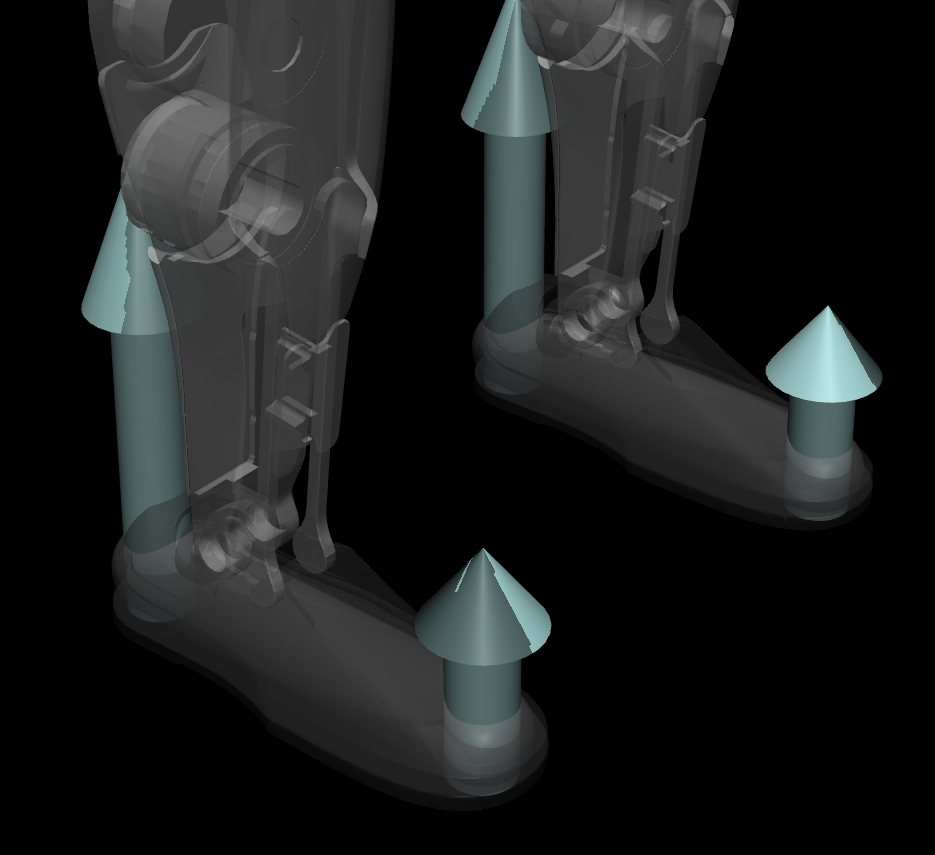

# MJX Benchmark for Unitree G1 Model

The following benchmark is conducted on a single 4090. The `FPS` implies frames sampled across all threads/cores. The `single_realtime_factor` is the realtime factor when only one thread/core is used. We also care about the second one since we are using it to do real-time control. 

We have already tried to limit contact pairs, lower the `iterations` and `ls_iterations`, disable `option/flag/eulerdamp` and enable `XLA_FLAGS=--xla_gpu_triton_gemm_any=true`. 

But it seems like it is pretty hard to push the `single_realtime_factor` to be close to `50`. This is important to use since this determines the maximum horizon we can use for MPC. 

We have tried the following tweaks but no luck. Any feedback is appreciated!

## Questions

### Simplier Contact Model Doesn't Change Performance

Simplify 4-sphere model to single-capsule model. Originally, we use 4-sphere model to approximate the foot contact. When we simplify it to single-capsule model, the `single_realtime_factor` seems doesn't change a lot. But given that now the simulator only need to check 2 collision pairs instead of 8 (we have two legs), shouldn't the speed be improved?

| 4-sphere model | single-capsule model | performance |
| ------------- | ------------- | ------------- |
|  |  |   |

### Why realtime factor will be affected by batch size?

Given that simplifying the contact model doesn't change the performance much, does it mean that the performance is limited by other factors? If so, which ones could be the bottleneck? Or it is impossible to get close to realtime factor 50?

### Is there anyway to dynamically update obstacles in mujoco?
